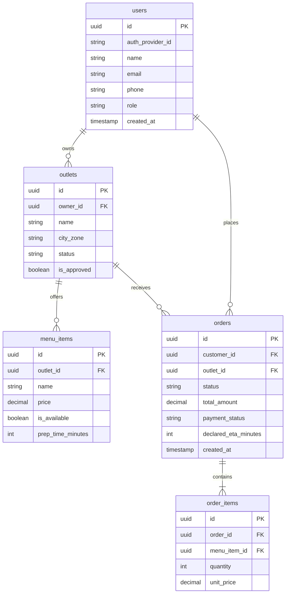

```mermaid
erDiagram
    users {
        uuid id PK
        string auth_provider_id
        string name
        string email
        string phone
        string role
        timestamp created_at
    }

    outlets {
        uuid id PK
        uuid owner_id FK
        string name
        string city_zone
        string status
        boolean is_approved
    }

    menu_items {
        uuid id PK
        uuid outlet_id FK
        string name
        decimal price
        boolean is_available
        int prep_time_minutes
    }

    orders {
        uuid id PK
        uuid customer_id FK
        uuid outlet_id FK
        string status
        decimal total_amount
        string payment_status
        int declared_eta_minutes
        timestamp created_at
    }

    order_items {
        uuid id PK
        uuid order_id FK
        uuid menu_item_id FK
        int quantity
        decimal unit_price
    }

    users ||--o{ outlets : "owns"
    outlets ||--o{ menu_items : "offers"
    users ||--o{ orders : "places"
    outlets ||--o{ orders : "receives"
    orders ||--|{ order_items : "contains"
```
