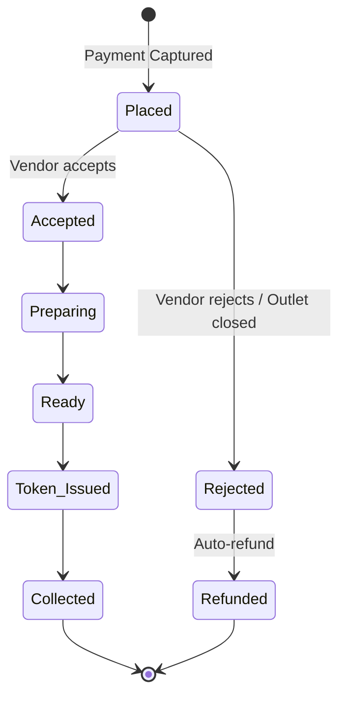

# Order State Machine

Based on `3_order_states.mmd`:

```mermaid
stateDiagram-v2
    [*] --> Placed : Payment Captured
    
    Placed --> Accepted : Vendor accepts
    Placed --> Rejected : Vendor rejects / Outlet closed
    Rejected --> Refunded : Auto-refund
    
    Accepted --> Preparing
    Preparing --> Ready
    Ready --> Token_Issued
    Token_Issued --> Collected
    
    Collected --> [*]
    Refunded --> [*]
```
